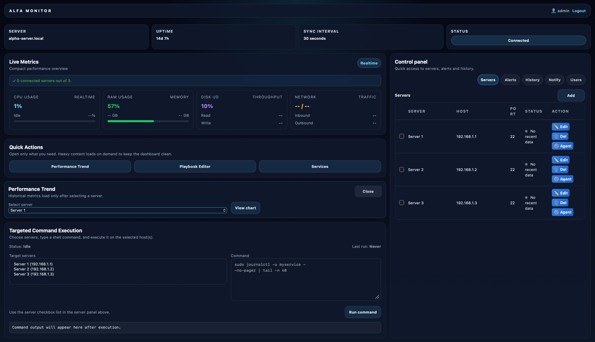
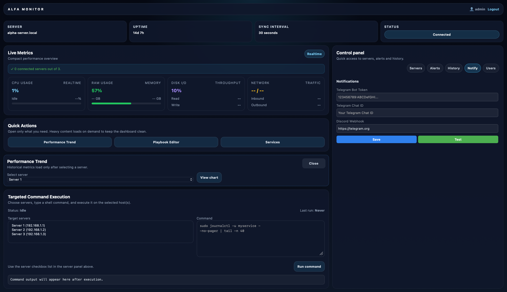

# AlfaMonitor

## Example Pictures
<p>



AlfaMonitor is a Python-based monitoring dashboard for Linux and Windows servers. It provides live metrics, alerting, and Ansible integration through a Flask backend and lightweight agent.

## Project Overview

AlfaMonitor includes a centralized dashboard to monitor server CPU, RAM, disk, temperature, and service status. Alerts can be delivered via Telegram and Discord, and managed servers can run Ansible playbooks from the dashboard.

## Key Features

- Live dashboard with WebSocket updates
- Server health metrics: CPU, RAM, disk, temperature, network, and services
- Telegram and Discord alerting
- Cross-platform agent support for Linux and Windows
- Ansible playbook execution from the UI
- Admin login and user management
- Configurable periodic Telegram status notifications

## Core Services

- `backend/main.py` — Flask app, APIs, socket events, and periodic workers
- `backend/alerting.py` — notification delivery via Telegram and Discord
- `backend/ansible_manager.py` — Ansible orchestration and commands
- `backend/database.py` — SQLAlchemy engine and sessions
- `backend/models.py` — database schema definitions
- `backend/websocket.py` — Socket.IO initialization and helpers
- `agents/agent.py` — cross-platform monitoring agent
- `agents/system_info.py` — metrics collection for Linux and Windows
- `static/js/app.js` — frontend dashboard logic
- `templates/dashboard.html` — dashboard layout and controls

## Project Structure

```text
.
├── LICENSE
├── README.md
├── requirements.txt
├── .env.example
├── agents
│   ├── agent.py
│   ├── config.py
│   └── system_info.py
├── ansible
│   ├── inventory.ini
│   └── playbook.yml
├── backend
│   ├── __init__.py
│   ├── alerting.py
│   ├── ansible_manager.py
│   ├── auth.py
│   ├── crypto.py
│   ├── database.py
│   ├── main.py
│   ├── models.py
│   └── websocket.py
├── static
│   ├── agent_install_instructions.txt
│   ├── agent_service.template
│   ├── css
│   │   └── style.css
│   └── js
│       └── app.js
└── templates
    ├── dashboard.html
    └── login.html
```

## Prerequisites

### Supported operating systems

- Rocky Linux
- Fedora
- CentOS
- Other Linux distributions with Python 3 support

### Required packages

On Rocky/Fedora:

```bash
sudo dnf install -y epel-release
sudo dnf install -y python3 python3-devel python3-virtualenv python3-pip gcc openssl-devel libffi-devel make git
```

On CentOS 7:

```bash
sudo yum install -y epel-release
sudo yum install -y python3 python3-devel python3-virtualenv python3-pip gcc openssl-devel libffi-devel make git
```

### Python requirements

- Python 3.8+
- Flask
- Flask-SocketIO
- SQLAlchemy
- passlib[bcrypt]
- requests
- psutil
- ansible-core
- python-dotenv
- cryptography

## Installation

1. Clone the repository:

```bash
git clone https://github.com/Rixwansaleem/AlfaMonitor.git
cd AlfaMonitor
```

2. Create and activate a Python virtual environment:

```bash
python3 -m venv venv
source venv/bin/activate
```

3. Install Python dependencies:

```bash
pip install --upgrade pip
pip install -r requirements.txt
```

4. Configure environment variables:

```bash
export SECRET_KEY="replace-with-secret"
export ADMIN_USER="admin"
export ADMIN_PASSWORD="password"
export TELEGRAM_TOKEN="your-telegram-token"
export TELEGRAM_CHAT_ID="your-chat-id"
export DISCORD_WEBHOOK_URL="https://discord.com/api/webhooks/..."
export TELEGRAM_NOTIFY_INTERVAL="300"
```

5. (Optional) copy example environment file:

```bash
cp .env.example .env
```

## Configuration

### Environment variables

- `SECRET_KEY` — Flask session secret
- `ADMIN_USER` — default admin username
- `ADMIN_PASSWORD` — default admin password
- `TELEGRAM_TOKEN` — Telegram bot token
- `TELEGRAM_CHAT_ID` — Telegram chat or group ID
- `DISCORD_WEBHOOK_URL` — Discord webhook URL for alerts
- `TELEGRAM_NOTIFY_INTERVAL` — periodic Telegram status update interval in seconds

> Tip: For production, keep secrets in a secure environment and do not commit them to source control.

## Running the App

Activate the virtual environment and start the dashboard:

```bash
source venv/bin/activate
python backend/main.py
```

Open the app at:

```bash
http://0.0.0.0:5000
```

## Create a systemd Service

Create `/etc/systemd/system/alfamonitor.service` with the following content:

```ini
[Unit]
Description=AlfaMonitor Dashboard
After=network.target

[Service]
Type=simple
User=youruser
WorkingDirectory=/path/to/AlfaMonitor
Environment="PATH=/path/to/AlfaMonitor/venv/bin"
Environment="SECRET_KEY=replace-with-secret"
Environment="ADMIN_USER=admin"
Environment="ADMIN_PASSWORD=password"
Environment="TELEGRAM_TOKEN=your-telegram-token"
Environment="TELEGRAM_CHAT_ID=your-chat-id"
Environment="DISCORD_WEBHOOK_URL=https://discord.com/api/webhooks/..."
ExecStart=/path/to/AlfaMonitor/venv/bin/python backend/main.py
Restart=always
RestartSec=5

[Install]
WantedBy=multi-user.target
```

Then enable and start it:

```bash
sudo systemctl daemon-reload
sudo systemctl enable alfamonitor
sudo systemctl start alfamonitor
sudo systemctl status alfamonitor
```

## Agent Installation

### Linux agent

Copy `agents/agent.py`, `agents/system_info.py`, and `agents/config.py` to the target host and run:

```bash
python3 agent.py --host YOUR_DASHBOARD_HOST --username agent --port 22
```

### Windows agent

Install Python 3 on Windows, copy the agent files, install dependencies, and run:

```powershell
pip install psutil requests
python agent.py --host YOUR_DASHBOARD_HOST --username agent --port 3389
```

### Scheduling agent execution

#### Linux cron example

```cron
*/2 * * * * cd /opt/monitoring-agent && /usr/bin/python3 agent.py --host YOUR_DASHBOARD_HOST --username agent --port 22 >> /var/log/monitoring-agent.log 2>&1
```

#### Windows Task Scheduler

Use Task Scheduler to run the agent every 2 minutes with the Python executable.

## Notification Settings

The dashboard Notifications tab supports:

- enabling/disabling Telegram alerts
- storing Telegram bot token and chat ID
- setting the notification interval
- saving settings to the database
- sending a test notification

## Dependencies

Dependencies are managed in `requirements.txt` and installed with:

```bash
pip install -r requirements.txt
```

## Support & Contribution

To contribute: Rizwan Saleem

1. Fork the repository
2. Create a feature branch
3. Commit changes with clear messages
4. Open a pull request

For support, open an issue with: malik.chand@hotmail.com

- your OS and Python version
- what you tried
- any error logs

## Notes

- Use HTTPS or a reverse proxy for production deployments.
- Secure credentials and secret keys carefully.
- Configure firewalls and network access for the dashboard and remote agents.
