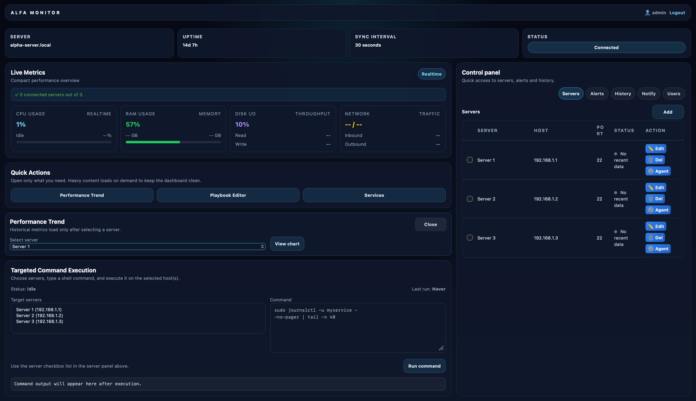
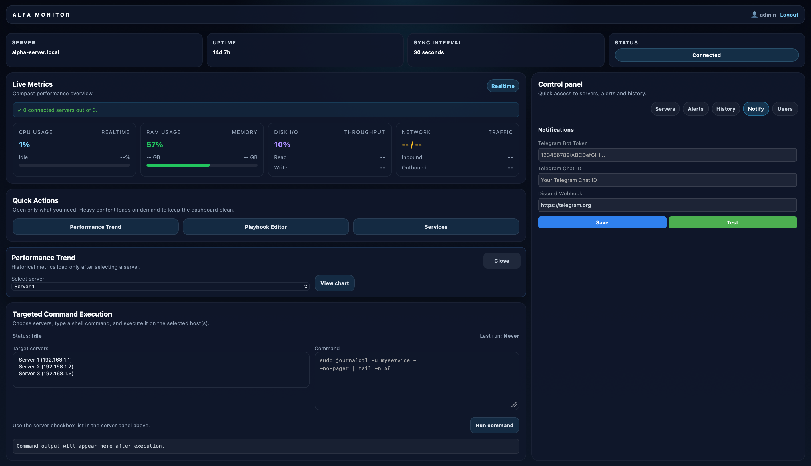

# AlfaMonitor

## Example Pictures
<p>


</p>

AlfaMonitor is a Python-based monitoring dashboard for Linux and Windows servers. It provides live metrics, alerting, and Ansible integration through a Flask backend and lightweight agent.

## Project Overview

AlfaMonitor includes a centralized dashboard to monitor server CPU, RAM, disk, temperature, and service status. Alerts can be delivered via Telegram and Discord, and managed servers can run Ansible playbooks from the dashboard.

## Key Features

- Live dashboard with WebSocket updates
- Server health metrics: CPU, RAM, disk, temperature, network, and services
- Telegram and Discord alerting
- Cross-platform agent support for Linux and Windows
- Windows agent packaging support for one-file executable builds
- Install & uninstall window packages
- Ansible playbook execution from the UI
- Admin login and user management
- Configurable periodic Telegram status notifications

## Core Services

- `backend/main.py` — Flask app, APIs, socket events, and periodic workers
- `backend/alerting.py` — notification delivery via Telegram and Discord
- `backend/ansible_manager.py` — Ansible orchestration and commands
- `backend/database.py` — SQLAlchemy engine and sessions
- `backend/models.py` — database schema definitions
- `backend/websocket.py` — Socket.IO initialization and helpers
- `agents/agent.py` — cross-platform monitoring agent
- `agents/system_info.py` — metrics collection for Linux and Windows
- `static/js/app.js` — frontend dashboard logic
- `templates/dashboard.html` — dashboard layout and controls

## Project Structure

```text
.
├── LICENSE
├── README.md
├── requirements.txt
├── .env.example
├── agents
│   ├── agent.py
│   ├── config.py
│   └── system_info.py
├── ansible
│   ├── inventory.ini
│   └── playbook.yml
├── backend
│   ├── __init__.py
│   ├── alerting.py
│   ├── ansible_manager.py
│   ├── auth.py
│   ├── crypto.py
│   ├── database.py
│   ├── main.py
│   ├── models.py
│   └── websocket.py
├── static
│   ├── agent_install_instructions.txt
│   ├── agent_service.template
│   ├── windows_agent_build.ps1
│   ├── windows_agent_service.ps1
│   ├── css
│   │   └── style.css
│   └── js
│       └── app.js
└── templates
    ├── dashboard.html
    └── login.html
```

## Prerequisites

### Supported Operating Systems
- Rocky Linux (9 / 10)
- Fedora
- CentOS
- Other Linux distributions with Python 3 support

### Required Packages

#### On Rocky Linux / Red Hat / Fedora:
```bash
sudo dnf install -y epel-release
sudo dnf install -y python3 python3-devel python3-virtualenv python3-pip gcc openssl-devel libffi-devel make git dnf install python3 python3-pip python3-devel gcc nginx augeas-libs -y
```

#### If Repository / Package Conflicts Occur on Rocky Linux 10+:
If you run into missing wheel package issues during the step above, enable the CodeReady Linux Builder (CRB) repository and run the streamlined installer:
```bash
# 1. Enable the CodeReady Linux Builder repository
dnf config-manager --set-enabled crb

# 2. Re-run your streamlined installation list
dnf install -y python3 python3-devel python3-virtualenv python3-pip gcc openssl-devel libffi-devel make git nginx augeas-libs
```

#### On CentOS 8:
```bash
sudo yum install -y epel-release firewalld
sudo yum install -y python3 python3-devel python3-virtualenv python3-pip gcc openssl-devel libffi-devel make git
```

## Firewall Configuration

Ensure your system firewall allows access to Nginx (ports 80/443), Gunicorn (port 5000), and administrative access hooks:

```bash
sudo systemctl enable firewalld --now
sudo firewall-cmd --permanent --add-service=http
sudo firewall-cmd --permanent --add-service=https
sudo firewall-cmd --permanent --add-port=443/tcp
sudo firewall-cmd --permanent --add-port=8445/tcp
sudo firewall-cmd --permanent --add-port=5000/tcp
sudo firewall-cmd --reload
```

### Python Requirements
- Python 3.8+
- Flask
- Flask-SocketIO
- SQLAlchemy
- passlib[bcrypt]
- requests
- psutil
- ansible-core
- python-dotenv
- cryptography

## Installation & Deployment

### 1. Set Up the Project Directory
The application production configuration assumes it will run from the `/opt/panel/monitoring-dashboard` folder. Create this path and clone the repository:

```bash
mkdir -p /opt/panel
cd /opt/panel

# Clone the repository into 'monitoring-dashboard'
git clone https://github.com monitoring-dashboard
cd monitoring-dashboard
```

### 2. Set Up Log Directories
Gunicorn requires a system log path to exist prior to service startup. Execute the following to provision it:
```bash
sudo mkdir -p /var/log/monitoring-dashboard
sudo chmod 755 /var/log/monitoring-dashboard
```

### 3. Create and Activate a Python Virtual Environment
```bash
python3 -m venv venv
source venv/bin/activate
```

### 4. Install Python Dependencies & Gunicorn
```bash
pip install --upgrade pip
pip install -r requirements.txt
pip install gunicorn
```

### 5. Configure Environment Variables
Copy the example environment configuration template or generate a new `.env` file inside the root directory:
```bash
cp .env.example .env
nano .env
```

Populate the entries accordingly:
```bash
SECRET_KEY="replace-with-secret"
ADMIN_USER="admin"
ADMIN_PASSWORD="password"
TELEGRAM_TOKEN="your-telegram-token"
TELEGRAM_CHAT_ID="your-chat-id"
DISCORD_WEBHOOK_URL="https://discord.com..."
TELEGRAM_NOTIFY_INTERVAL="300"
```

## Running the Application Locally (For Development)

If you wish to test the application manually without using Systemd or Nginx, activate the virtual environment and initialize the primary server process directly:

```bash
source venv/bin/activate
python backend/main.py
```
The interface will be accessible at: `http://127.0.0.1:5000` or `http://0.0.0`
## Production Service Configuration

### 1. Create a Systemd Service File
Create the file `/etc/systemd/system/monitoring-dashboard.service` to daemonize the application backend:

```ini
[Unit]
Description=Monitoring Dashboard
After=network.target

[Service]
Environment=ADMIN_USER=admin
Environment=ADMIN_PASSWORD=Password
Type=simple
User=root
WorkingDirectory=/opt/panel/monitoring-dashboard
Environment="PATH=/opt/panel/monitoring-dashboard/venv/bin"
EnvironmentFile=/opt/panel/monitoring-dashboard/.env
ExecStart=/opt/panel/monitoring-dashboard/venv/bin/gunicorn \
    --workers 4 \
    --worker-class gthread --threads 4 \
    --bind 127.0.0.1:5000 \
    --access-logfile /var/log/monitoring-dashboard/access.log \
    --error-logfile /var/log/monitoring-dashboard/error.log \
    backend.main:app

Restart=always
RestartSec=10

[Install]
WantedBy=multi-user.target
```

Enable and initialize the systemd unit:
```bash
sudo systemctl daemon-reload
sudo systemctl enable --now monitoring-dashboard
```

---

### 2. Configure Nginx (Reverse Proxy)

Open or create your Nginx configuration block file:
```bash
sudo nano /etc/nginx/conf.d/monitoring-dashboard.conf
```

Choose **Option A** for standard HTTP traffic or **Option B** for production security with Let's Encrypt SSL.

#### Option A: Standard HTTP Deployment (Port 80)
```nginx
server {
    listen 80;
    server_name yourdomain.com; # Replace with your domain or server IP

    # Handle static assets directly via Nginx for speed
    location /static/ {
        alias /opt/panel/monitoring-dashboard/static/;
    }

    # Pass all other traffic to Gunicorn
    location / {
        proxy_pass http://127.0.0.1:5000;
        proxy_set_header Host $host;
        proxy_set_header X-Real-IP $remote_addr;
        proxy_set_header X-Forwarded-For $proxy_add_x_forwarded_for;
        proxy_set_header X-Forwarded-Proto $scheme;
    }
}
```

#### Option B: Secure Production HTTPS Deployment (Port 443 with SSL)
```nginx
# Redirect all HTTP traffic (Port 80) to secure HTTPS
server {
    listen 80;
    server_name yourdomain.com; # Replace with your domain or server IP
    return 301 https://$host$request_uri;
}

# Secure HTTPS Server Instance
server {
    listen 443 ssl;
    server_name yourdomain.com; # Replace with your domain or server IP

    # Let's Encrypt SSL Certificate File Paths
    ssl_certificate /etc/letsencrypt/live/://yourdomain.com;
    ssl_certificate_key /etc/letsencrypt/live/://yourdomain.com;

    # Hardened Production Security Parameters
    ssl_protocols TLSv1.2 TLSv1.3;
    ssl_ciphers HIGH:!aNULL:!MD5;
    ssl_prefer_server_ciphers on;

    # Handle static assets directly via Nginx
    location /static/ {
        alias /opt/panel/monitoring-dashboard/static/;
    }

    # Pass traffic to Gunicorn backend
    location / {
        proxy_pass http://127.0.0.1:5000;
        proxy_set_header Host $host;
        proxy_set_header X-Real-IP $remote_addr;
        proxy_set_header X-Forwarded-For $proxy_add_x_forwarded_for;
        proxy_set_header X-Forwarded-Proto $scheme;
    }
}
```

### 3. Initialize and Reload Web Services
```bash
# Test configurations for valid syntax
sudo nginx -t

# If successful, enable and execute web routing handles
sudo systemctl enable nginx --now
sudo systemctl restart nginx
sudo systemctl restart monitoring-dashboard
```

## Important: Resetting the Admin Profile

If your admin account password is lost or throws authentication mismatches, navigate to your root folder, execute the python terminal runtime, and use the built-in database correction script below:

```bash
cd /opt/panel/monitoring-dashboard
source venv/bin/activate
python3
```

Execute this script sequentially inside the active Python shell:
```python
import sqlite3
from backend.auth import create_admin_user

# Open a local session connection with the DB file
conn = sqlite3.connect('monitoring.db')
cursor = conn.cursor()

# Purge conflicting entries
cursor.execute("DELETE FROM users WHERE username='admin';")
conn.commit()
conn.close()

# Re-generate authorized crypt profile records
create_admin_user('admin', 'New_Password_Here')
print("Successfully generated and hashed admin user profile via native auth!")
exit()
```

## Agent Installation

### 1. Linux Agent
Copy `agents/agent.py`, `agents/system_info.py`, and `agents/config.py` to your target client machine and run:
```bash
python3 agent.py --host YOUR_DASHBOARD_HOST --username agent --port 22
```

### 2. Windows Agent
Install Python 3 on the target Windows system, copy the agent source files, install package requirements, and run:
```powershell
pip install psutil requests
python agent.py --host YOUR_DASHBOARD_HOST --username agent --port 3389
```

### 3. Build a Windows Executable Package (`.exe`)
If you prefer a lightweight, single-click deployment profile that runs on Windows machines without requiring a Python installation, use the included PowerShell builder toolkit:

1. Open a PowerShell instance as **Administrator** in your repository workspace folder.
2. Run the deployment automation helper script:
```powershell
powershell -ExecutionPolicy Bypass -File .\static\windows_agent_build.ps1
```
4. The build routine creates your output file at: `dist\AlfaMonitorAgent.exe`
5. Copy `dist\AlfaMonitorAgent.exe` to the Windows target machine.
6. Run the executable as Administrator, or install it as a Windows service / scheduled task with "Run with highest privileges" for unattended operation.

> 💡 **Note:** The built executable is the easiest way to run the Windows agent with admin privileges for dashboard-driven installer jobs.

### Scheduling Agent Execution

#### Linux Cron Example
```cron
*/2 * * * * cd /opt/monitoring-agent && /usr/bin/python3 agent.py --host YOUR_DASHBOARD_HOST --username agent --port 22 >> /var/log/monitoring-agent.log 2>&1
```

#### Windows Task Scheduler
Use Task Scheduler to run the agent every 2 minutes with the Python executable. Make sure to check the option **"Run with highest privileges"** to allow proper metrics harvesting.

## Notification Settings

The dashboard **Notifications** tab natively supports:
- Enabling/disabling Telegram alerts
- Storing Telegram bot token and chat ID
- Setting custom notification intervals
- Saving active configurations directly to the database
- Sending test loop notifications

## Dependencies
Dependencies are strictly tracked inside `requirements.txt` and can be caught or updated using:
```bash
pip install -r requirements.txt
```

## Support & Contribution

To contribute to this open-source repository:
1. Fork the repository
2. Create a specific feature branch
3. Commit your changes with clear messages
4. Open a pull request back into the main tree

For direct support, open a public tracking issue containing:
- Your core OS and Python version specifics
- Troubleshooting vectors you already tried
- Immediate relevant runtime error logs

## Notes
- Always use HTTPS or a secured reverse proxy infrastructure for public-facing production deployments.
- Secure your credentials and environment secret keys carefully. Never push custom `.env` files back into source repositories.
- Configure system firewalls and precise network security groups to control dashboard and remote agent connectivity paths.
- This project is fundamentally configured to run under the root profile context, but can easily be modified to execute using standard unprivileged system accounts.

## Support & Donations

If **AlfaMonitor** helps you monitor your infrastructure, consider supporting its development! ❤️

<p align="left">
  <a href="https://ko-fi.com/rizwansaleem" target="_blank">
    
  </a>
  <a href="https://www.paypal.com/paypalme/Malikchand" target="_blank">
    
  </a>
</p>

## Connect With Me

If you want to follow my work, collaborate on projects, or get in touch, let's connect! 👋

<p align="left">
  <a href="https://www.linkedin.com/in/rizwan-saleem-7b300068/" target="_blank">
    
  </a>
  <a href="https://x.com/linuxgen" target="_blank">
    
  </a>
  <a href="https://www.facebook.com/mRizwanSalem" target="_blank">
    
  </a>
  <a href="https://github.com/RixwanSaleem" target="_blank">
    
  </a>
</p>

## Credits & Authors

- **Lead Developer & Maintainer**: Rizwan Saleem
- **Email Contact & Support**: info@alfasolution.org / malik.chand@hotmail.com
- **Project URL**: [GitHub Repository](https://github.com)
